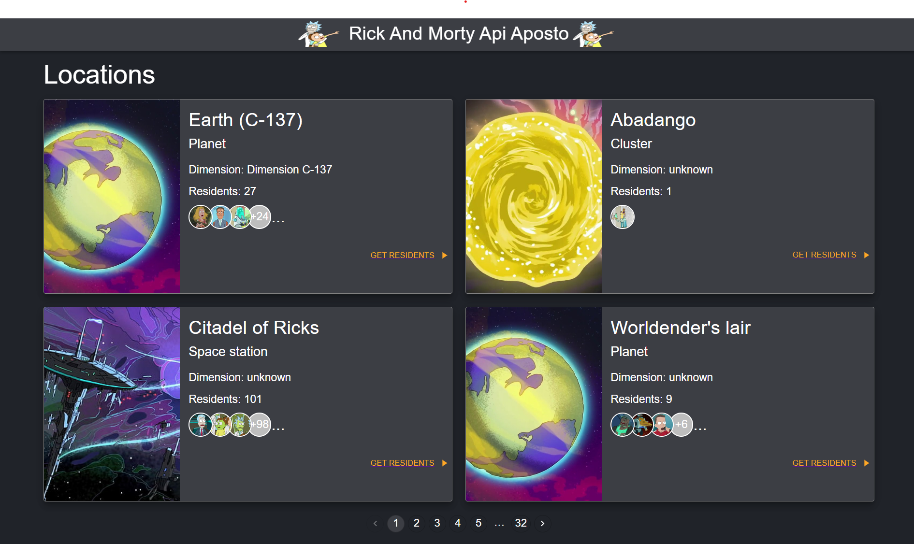
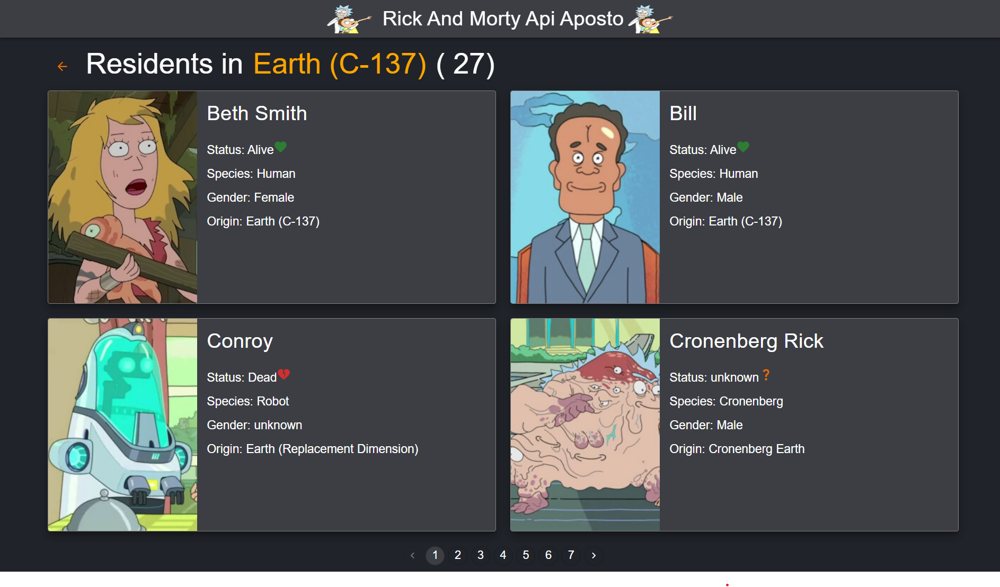

<!-- ABOUT THE PROJECT -->
## About The Project

[![Product Name Screen Shot][product-screenshot]](https://example.com)

## Getting Started

This App Created for Aposto Tech

## Screenshots
### Locations page:

### Residents page:



### Prerequisites

This is an example of how to list things you need to use the software and how to install them.

* npm
  ```sh
  npm install npm@latest -g
  ```

### Installation

_Below is an example of how you can instruct your audience on installing and setting up your app. This template doesn't rely on any external dependencies or services._

1. Clone the repo
   ```sh
   git clone https://github.com/asefa96/aposto-rick-and-morty.git
   ```
2. Install NPM packages (or use YARN)
   ```sh
   npm install
   ```
3. Start App
    ```sh
   npm run start
   ```

<p align="right">(<a href="#top">back to top</a>)</p>


<!-- ROADMAP -->
## Roadmap

- [] Add Code Comments
- [] Responsive Check
- [] Add Custom Wrappers
- [] Fix Bugs 


<!-- ACKNOWLEDGMENTS -->
## Libraries


* [Material UI](https://mui.com/)
* [React Router Dom v6](https://reactrouter.com/)
* [Redux](https://redux.js.org/)
